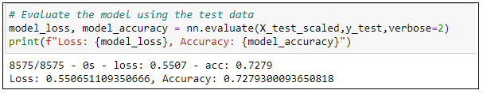

# Neural Network Charity Analysis

## Overview

Beks is a data scientist and programmer for the non-profit foundation **Alphabet Soup**. They're a philanthropic foundation dedicated to helping organizations that protect the environment, improve people's well-being, and unify the world. Alphabet Soup has raised and donated over 10 billion dollars in the past 20 years. This money has been used to invest in lifesaving technologies and organize reforestation groups around the world. Beks is in charge of data collection and analysis for the entire organization. Her job is analyze the impact of each doantion and vet potential recipients. This helps ensure that the  foundation's money is being used effectively. Unfortunately, not every donation the comapany makes is impactful. In some cases an organization will take the money and disappear. As a result, Aphabet Soup's president Andy Glad has asked Beks to predict which organizations are worth donating to and which are too high risk. He wants her to create a mathematical data driven solution that can do this accurately. Beks has decided that this problem is too complex for the statistical and machine learning models that she has used. Instead she will designa and train a deep learning neural network. This model will evaluate all types of input data and produce a clear decision making result. 

In this module, I will help Beks learn about neural networks and how to design and train these models using the Python TensorFlow library. I will rely on my past experience with statistics and machine learning to help test and optimize your models.

## Objective of this assignment
Beks is now ready to put her skills to work to help the foundation predict where to make investments. Beks and I will use the features in the provided dataset to help Beks create a binary classifier that is capable of predicting whether applicants will be successful if funded by **Alphabet Soup**.

## Resources
* Software/Tools: Visual Studio Code (v1.49.2), Anaconda 8, Jupyter Notebook
* Language(s): Python 3.7.6
* Libraries: TensorFlow, Keras, Pandas, sklearn
* Data Source(s): https://github.com/Govind-Patwal/Neural_Network_Charity_Analysis/blob/main/Resources/charity_data.csv

## Results

Initial Deep-learning Model

### Data Preprocessing
* What variable(s) are considered the target(s) for your model?
    * IS_SUCCESSFUL
* What variable(s) are considered to be the features for your model?
    * APPLICATION_TYPE, AFFILIATION, CLASSIFICATION, USE_CASE, ORGANIZATION, STATUS, INCOME_AMT, SPECIAL_CONSIDERATIONS, ASK_AMT 

* What variable(s) are neither targets nor features, and should be removed from the input data?

## Compiling, Training, and Evaluating the Model
* How many neurons, layers, and activation functions did you select for your neural network model, and why?
    * I experimented with many layers, neurons and many activation functions
* Were you able to achieve the target model performance?
    * No I was not able to touch 75%
* What steps did you take to try and increase model performance?
    * Worked with the number of neurons, changed some activation functions, worked with number of layers and number of epoches
